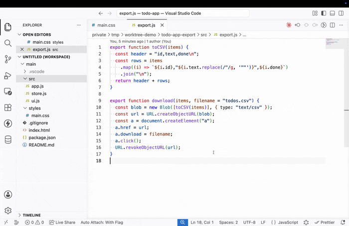

# Git Worktree Switcher

A VS Code extension for switching between git worktrees in a single window. Designed for use with Claude Code, where worktrees are created frequently as part of agentic workflows and you want to inspect them without losing your current Claude session state.



## Why

Switching VS Code workspace folders typically reloads the window, which restarts all extensions — losing your Claude Code chat panel state, terminal sessions, and editor layout. This extension lets you switch between worktrees by manipulating the workspace folder list directly, so the window never reloads.

## Commands

All commands are available from the Command Palette (`Cmd+Shift+P`) prefixed with `Worktrees:`.

- **Focus Worktree** — Pick a worktree from any discovered repo. The workspace is replaced with just that one folder. Search, Quick Open, and Explorer are naturally scoped to that worktree.
- **Clear Worktree Focus** (a.k.a. unfocus / show all) — Replace the workspace with all worktrees of all discovered repos.
- **Refresh / Auto-Add All Worktrees** — Force a re-scan for new worktrees (e.g. after Claude Code creates one) and replace the workspace.
- **Show Logs** — Open the Output channel for debugging.

## Multi-repo support

If your workspace folder contains multiple git repositories (e.g. `~/projects/monorepo/repos/{repo1,repo2,...}`), the extension scans up to 2 levels deep to discover them. Discovered repos are deduplicated by their `git common-dir`, and worktree labels are prefixed with the repo name (`repo1 / feature-a`) when more than one repo is in play.

## How it works

- `git worktree list --porcelain` is parsed for each discovered repo
- The "main worktree" is detected (first non-bare entry)
- `vscode.workspace.updateWorkspaceFolders` swaps the workspace folder set in place — no window reload, no extension restart
- After a focus/show-all operation, the explorer is collapsed for a clean tree
- Repo discovery results are cached for 60 seconds and invalidated when the workspace folder set changes; pre-warmed on activation

## Development

```bash
npm install
npm test            # vitest (unit tests for pure logic)
npm run compile     # type-check + lint + build
npm run watch       # rebuild on change
```

Press **F5** in VS Code to launch the Extension Development Host.

### Testing

- Pure logic (porcelain parsing, label generation, focus/show-all entry building, repo discovery filtering) is covered by Vitest in `tests/`.
- Run `npm test` for a single pass, `npm run test:watch` for watch mode.

## License

MIT — see [LICENSE](./LICENSE).
